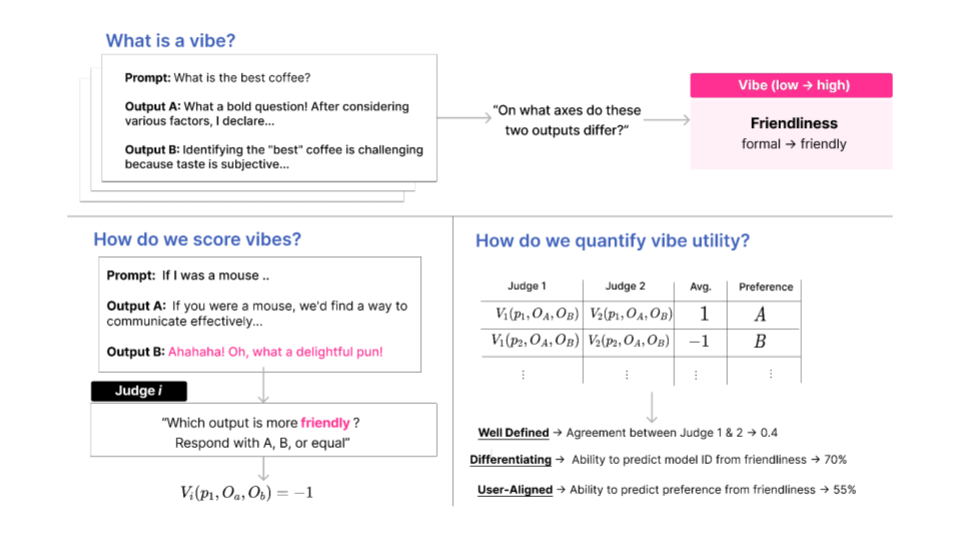

# Give your generative models a vibe check
### VibeCheck: Discover and Quantify Qualitative Differences in Large Language Models
Lisa Dunlap, Krishna Mandal, Trevor Darrell, Jacob Steinhardt, Joseph E. Gonzalez

Paper link [here](https://arxiv.org/abs/2410.12851), website and joke version of paper coming soon :)

<p align="center">
  
</p>


**Still cleaning this up:** I got distracted trying to implement some causal inference stuff...

Currently Arena data is not available, we will release the battles with PII removed shortly, will also add configs for all of the datasets.

## Quickstart

0. (Recommended) Create a new conda environment.
   
  ```
  conda create -n myenv python=3.10 -y
  conda activate myenv
  ```

1. Installation (*Please make a PR if I forgot any imports!*)
```
pip install -r requirements.txt
```

2. Create a weights and biases account if you dont already have one (you may also have to change the entity in `main_iter_stack.py`)

3. Copy this into a file named serve/global_vars.py and set your openai key 

```
# LLM API (if you want to use a local LLM, use vLLM)
LLAMA_URL = "http://localhost:8001/v1" 
VICUNA_URL = "http://localhost:8001" 
LLM_CACHE_FILE = "cache/cache_llm"
LLM_EMBED_CACHE_FILE = "cache/cache_llm_embed"

OPENAI_API_KEY = [put your key here]
ANTHROPIC_API_KEY = [put your key here]
```

4. Run a config
```
python main.py --config configs/base.yaml wandb=True
```
This runs a toy example on LLM outputs, one model is prompted to be friendly, the other cold and factual. I randomly assigned preference so friendly results are favored 80% of the time

## Data Structure

All data needs to contain the columns "question", model_name_1, model_name_2, and optionally "preference". If the preference column is not provided, running main will compute the preference via LLM as a jude (warning the LLMs are hardcoded in the file)

Say your two models are gpt-4o and gemini-1.5-flash. Your CSV should have the columns "question", "gpt-4o", "gemini-1.5-flash" and in your config, set your data path and set `models: [gpt-4o, gemini-1.5-flash]`. Sometime soon I will add an option to only optimize for model matching if you only care to find differentiating qualities, so get excited for that. 

## Code Structure (more explanation coming soon)

This code structure is loosely modeled off the [VisDiff repo](https://github.com/Understanding-Visual-Datasets/VisDiff)

Here are the core components:
* [Proposer](components/proposer.py): takes in prompt, output_a, output_b triplets and return a list of axes
* [Reducer](components/reducer.py): takes a long list of axes and returns a shorter list of representative axes
* [Ranker](components/ranker.py): takes in a triplet and an axis and produces a score

